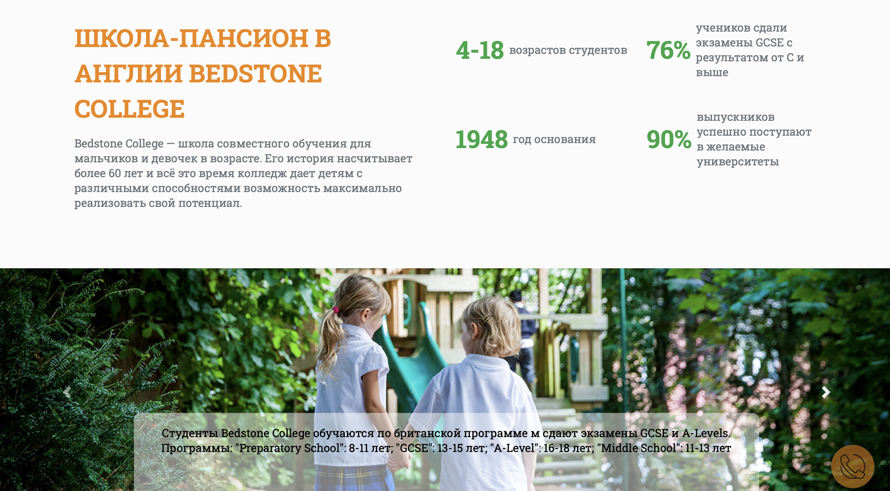
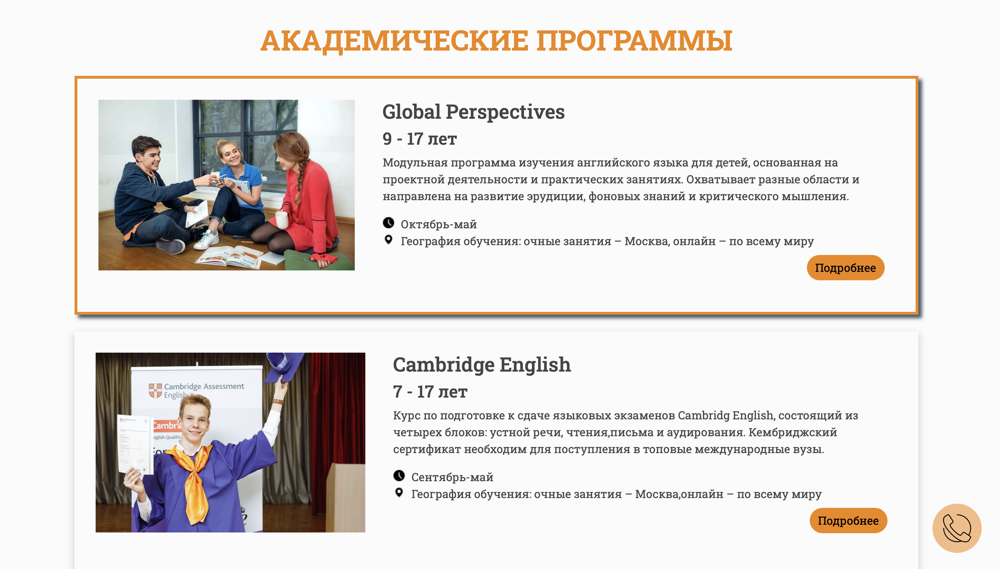

# Lingua Forward English School

A web site for the owner of English school

## Getting started

Host the parent directory on the wenserver

## Technologies :

## Technologies:

<code></code>
<code></code>
<code></code>

## Thanks to all Contributors

## Result:
